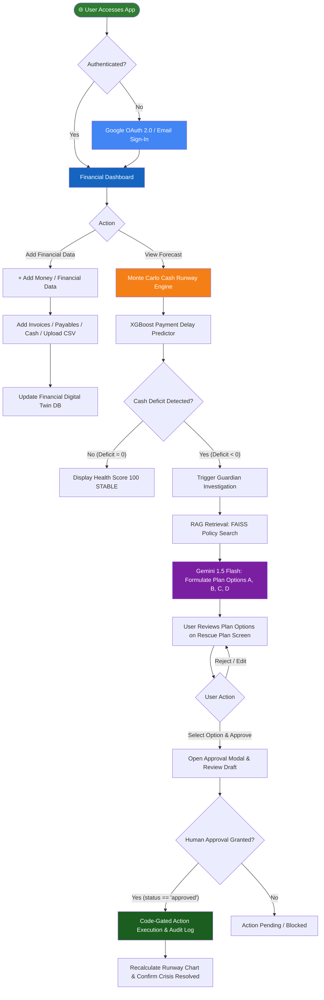

<div align="center">

# ✦ CashFlow Guardian

### *AI-Powered Financial Early-Warning & Rescue System for Indian MSMEs*

[](https://www.python.org/)
[](https://fastapi.tiangolo.com/)
[](https://reactjs.org/)
[](https://www.typescriptlang.org/)
[](https://vitejs.org/)
[](https://github.com/facebookresearch/faiss)
[](https://aistudio.google.com/)
[](http://localhost:5173)
[](https://github.com/ArokiyaNithish/CASHFLOW-GUARDIAN)

> 🚀 **Predict the cash crisis. Understand why. Plan the rescue. Act before it happens.**  
> CashFlow Guardian is an autonomous Agentic Finance platform built for Micro, Small, and Medium Enterprises (MSMEs). It transforms financial management from passive dashboard monitoring into proactive, code-gated financial crisis prevention.

</div>

---

## 📋 Table of Contents

- [📌 Problem Statement](#-problem-statement)
- [💡 Solution & Approach](#-solution--approach)
- [🎯 Objectives](#-objectives)
- [🛠️ Technology Stack](#️-technology-stack)
- [📁 Project Structure](#-project-structure)
- [🔬 How It Works — System Flowchart](#-how-it-works--system-flowchart)
- [💻 Code Analysis](#-code-analysis)
- [📦 Dependencies](#-dependencies)
- [🚀 Installation & Setup](#-installation--setup)
- [🎬 System Demo](#-system-demo)
- [🌍 Impact & Real-World Significance](#-impact--real-world-significance)
- [🔮 Future Enhancements](#-future-enhancements)
- [🤝 Open Source Contribution](#-open-source-contribution)
- [👨‍💻 Author & Acknowledgments](#-author--acknowledgments)

---

## 📌 Problem Statement

> **"Most MSMEs don't fail because they are unprofitable — they fail because they run out of usable cash at the wrong time."**

### Background

In India, MSMEs form the backbone of the economy, yet billions of rupees in receivables are locked in delayed payments. Under the MSMED Act, payments are mandated within 45 days, but in practice, small businesses face severe payment delays from large buyers.

A manufacturing MSME may show positive net profit on paper because:
$$\text{Total Assets / Expected Receivables} > \text{Total Payables}$$

However, the real daily question is: **Will sufficient liquid cash be available on Day 7 for supplier payments, on Day 10 for staff payroll, or on Day 12 for loan EMIs?**

### The Core Problem

| Challenge | Description | Impact on MSMEs |
|-----------|-------------|-----------------|
| 🔴 **Passive Dashboards** | Accounting tools display static past balances without forecasting upcoming gaps | Business owners discover cash deficits after cheques bounce |
| 🔴 **Uncertain Payment Timing** | Assuming $100\%$ invoice recovery on due dates ignores real buyer delay patterns | A 12-day customer delay triggers emergency loan high-interest penalties |
| 🔴 **Timing Mismatches** | Payables, payroll, and taxes fall due before customer receivables arrive | Worsening liquidity crises even when profitable |
| 🔴 **Lack of Actionable Rescue Plans** | Traditional software tells owners *that* cash is low, but not *what specific actions* to take | Owners waste critical days trying to negotiate without policy data |
| 🔴 **Autonomous Execution Risks** | Naive AI agents executing money transfers or sending emails without human review | High risk of unintended legal, financial, or relationship damage |

---

## 💡 Solution & Approach

### Our Strategy

CashFlow Guardian shifts financial software from **Financial Monitoring** ("Your cash balance is low") to **Financial Prevention** ("You are likely to have a ₹1.4 Lakh cash deficit in 17 days. Here are 3 viable rescue options, policy justifications, and an actionable execution plan").

```text
┌─────────────────────────┐     ┌─────────────────────────┐     ┌─────────────────────────┐
│     FINANCIAL DATA      │ ──> │  FINANCIAL DIGITAL TWIN │ ──> │   MONTE CARLO ENGINE    │
│ Cash, Invoices, Payables│     │ Receivables & Behavior  │     │ 30-Day P10/P50/P90 FC   │
└─────────────────────────┘     └─────────────────────────┘     └─────────────────────────┘
                                                                             │
┌─────────────────────────┐     ┌─────────────────────────┐                  ▼
│ CODE-GATED EXECUTION    │ <── │   HUMAN APPROVAL GATE   │ <── ┌─────────────────────────┐
│ L1 Auto / L2 Human Gate │     │ Owner Accepts / Denies  │     │ RAG + AGENTIC REASONING │
└─────────────────────────┘     └─────────────────────────┘     │ Gemini 1.5 + FAISS Vector│
                                                                └─────────────────────────┘
```

1. **Financial Digital Twin**: Maintains a live representation of available cash, safety reserves, customer payment probabilities, supplier flexibility, and recurring obligations.
2. **XGBoost Payment Delay Predictor**: Replaces naive invoice due dates with probabilistic payment arrival dates based on buyer behavior.
3. **Monte Carlo Runway Forecaster**: Simulates 200+ stochastic daily cash trajectories over a 30-day horizon, detecting P10 (worst-case), P50 (expected), and P90 (best-case) deficit days.
4. **FAISS RAG Policy Knowledge Base**: Retrieves statutory policies (MSMED 45-day rule, TReDS eligibility, invoice financing criteria, early-payment discount policies).
5. **Agentic Reason-Plan-Act Loop**: Formulates multi-option rescue plans (early payment requests, supplier payment deferrals, TReDS financing) with automated draft generation.
6. **Code-Gated Human Approval Gate**: Enforces strict permission boundaries ($L1\text{ Auto}$, $L2\text{ Approval Required}$, $L3\text{ Blocked}$). No financial action executes until status is explicitly `'approved'`.

---

## 🎯 Objectives

- ✅ **Build a live Financial Digital Twin** tracking cash, invoices, payables, and recurring obligations in real time.
- ✅ **Implement XGBoost ML payment delay prediction** to forecast realistic customer payment dates.
- ✅ **Deploy a 30-day Monte Carlo Cash Runway Simulator** generating P10/P50/P90 scenarios.
- ✅ **Embed a FAISS Vector RAG engine** loaded with 15 MSME financial regulations and policy documents.
- ✅ **Develop an Agentic AI Orchestrator** using Google Gemini 1.5 Flash for reasoning and rescue plan generation.
- ✅ **Enforce strict code-gated safety boundaries** requiring owner approval before executing any external action.
- ✅ **Provide a modern, responsive React 18 + Vite UI** starting with a clean zero-state dashboard and manual/CSV data entry.
- ✅ **Integrate Google OAuth 2.0 Identity Services** for instant single-click sign-in.

---

## 🛠️ Technology Stack

### Backend & AI Architecture

| Component | Technology | Version | Role & Description |
|-----------|------------|---------|---------------------|
| **Core Framework** | FastAPI | 0.109.x | Asynchronous REST API server |
| **Language** | Python | 3.11+ | Primary backend programming language |
| **Database** | SQLite + SQLAlchemy | 2.0 (Async) | Asynchronous ORM and relational database storage |
| **ML Engine** | XGBoost / Scikit-Learn | 2.0.x / 1.4.x | Customer payment delay & probability prediction |
| **Runway Engine** | NumPy / Monte Carlo | 1.26.x | 30-day stochastic daily cash runway forecasting |
| **Vector Store** | FAISS CPU | 1.7.4 | Dense vector indexing for RAG policy retrieval |
| **Embeddings** | Sentence-Transformers | `all-MiniLM-L6-v2` | 384-dimensional semantic text embeddings |
| **LLM Engine** | Google Gemini API | `gemini-1.5-flash` | Generative AI reasoning, plan formulation, Q&A |
| **Security & Auth** | Passlib / PyJWT | Bcrypt / HS256 | Password hashing and JWT bearer authentication |

### Frontend & UI Architecture

| Component | Technology | Version | Purpose |
|-----------|------------|---------|---------|
| **UI Library** | React | 18.2.x | Component-based frontend user interface |
| **Language** | TypeScript | 5.2.x | Type-safe client-side application logic |
| **Build Tool** | Vite | 5.4.x | Next-generation fast frontend bundler & dev server |
| **Styling** | Vanilla CSS + Design Tokens | Custom HSL | Fluid responsive design with zero decorative fluff |
| **State Management**| Zustand + Persist | 4.5.x | Centralized persistent app state store |
| **Icons** | Lucide React | 0.344.x | Modern UI vector icon set |
| **OAuth** | Google Identity Services | GIS / GSI SDK | Google OAuth 2.0 single-click authentication |

---

## 📦 Dependencies

### Backend Dependencies (`backend/requirements.txt`)

```text
fastapi>=0.109.0
uvicorn>=0.27.0
sqlalchemy>=2.0.25
aiosqlite>=0.19.0
pydantic>=2.6.0
pydantic-settings>=2.1.0
xgboost>=2.0.3
scikit-learn>=1.4.0
numpy>=1.26.3
sentence-transformers>=2.3.1
faiss-cpu>=1.7.4
google-generativeai>=0.4.0
langchain-google-genai>=0.0.6
python-jose>=3.3.0
passlib[bcrypt]>=1.7.4
python-multipart>=0.0.6
```

### Frontend Dependencies (`frontend/package.json`)

```json
{
  "dependencies": {
    "react": "^18.2.0",
    "react-dom": "^18.2.0",
    "react-router-dom": "^6.22.1",
    "zustand": "^4.5.1",
    "lucide-react": "^0.344.0",
    "axios": "^1.6.7",
    "react-hot-toast": "^2.4.1"
  },
  "devDependencies": {
    "@types/react": "^18.2.55",
    "@types/react-dom": "^18.2.19",
    "@vitejs/plugin-react": "^4.2.1",
    "typescript": "^5.2.2",
    "vite": "^5.4.21"
  }
}
```

---

## 📁 Project Structure

```text
CASHFLOW-GUARDIAN/
│
├── 📁 backend/                         # FastAPI Backend Application
│   ├── 📁 app/
│   │   ├── 📁 agent/                   # Agentic AI Orchestrator & Rules Engine
│   │   │   ├── 📄 orchestrator.py      # LangGraph / Gemini Reason-Plan-Act Engine
│   │   │   ├── 📄 prompts.py           # System prompts & email generation templates
│   │   │   ├── 📄 rules_engine.py      # L1/L2/L3 safety permission boundary evaluator
│   │   │   └── 📄 tools.py             # 8 Agent tools (payment reminder, financing, etc.)
│   │   ├── 📁 core/                    # Core Config, Database & Auth
│   │   │   ├── 📄 auth.py              # JWT authentication & Google token verifier
│   │   │   ├── 📄 config.py            # Pydantic Settings & environment loader
│   │   │   └── 📄 database.py          # SQLAlchemy Async engine & session setup
│   │   ├── 📁 ml/                      # Machine Learning Models
│   │   │   ├── 📄 anomaly.py           # IsolationForest transaction anomaly detector
│   │   │   ├── 📄 forecast.py          # Monte Carlo 30-day cash runway simulator
│   │   │   ├── 📄 payment_delay.py     # XGBoost customer payment delay model
│   │   │   └── 📄 risk.py              # Risk Scoring Rules Engine (0-100)
│   │   ├── 📁 models/                  # SQLAlchemy Relational Models
│   │   │   └── 📄 all_models.py        # Company, User, Invoice, Payable, Transaction, etc.
│   │   ├── 📁 rag/                     # RAG Vector Store & Retrieval
│   │   │   ├── 📁 faiss_index/         # FAISS index & pkl metadata chunks
│   │   │   ├── 📄 ingest.py            # Ingests markdown policies using sentence-transformers
│   │   │   └── 📄 retrieve.py          # Vector similarity search with keyword fallback
│   │   ├── 📁 routers/                 # REST API Endpoints
│   │   │   ├── 📄 actions.py           # Action approval & code-gated execution
│   │   │   ├── 📄 agent.py             # Agent plan generation endpoint
│   │   │   ├── 📄 ask.py               # Grounded Q&A endpoint with Gemini API
│   │   │   ├── 📄 auth.py              # Password & Google OAuth sign-in endpoints
│   │   │   ├── 📄 companies.py         # Snapshot & invoice data endpoints
│   │   │   ├── 📄 data.py              # Manual entry (Invoice, Payable, Cash) & CSV upload
│   │   │   ├── 📄 forecast.py          # Forecast execution endpoints
│   │   │   └── 📄 simulator.py         # What-If scenario simulation router
│   │   └── 📁 schemas/                 # Pydantic Data Schemas
│   │       └── 📄 all_schemas.py       # API Request/Response models
│   ├── 📄 main.py                      # FastAPI application entry point
│   ├── 📄 requirements.txt             # Python backend dependencies
│   ├── 📄 seed_runner.py               # Synthetic database seeder
│   └── 📄 test_api.py                  # 10-step End-to-End integration test suite
│
├── 📁 docs/
│   └── 📁 policies/                    # 15 MSME Financial Policy Markdown Documents
│       ├── 📄 msme_payment_norms.md     # MSMED Act 45-day rule & 3x bank rate interest
│       ├── 📄 treds_eligibility.md     # TReDS discounting eligibility rules
│       ├── 📄 safety_reserve_policy.md # Working capital buffer guidelines
│       └── 📄 ...                      # Additional financial policy guides
│
├── 📁 frontend/                        # React 18 + Vite Frontend Application
│   ├── 📁 src/
│   │   ├── 📁 api/                     # Axios API client methods
│   │   │   └── 📄 client.ts            # Client interface for all FastAPI endpoints
│   │   ├── 📁 components/              # Modular UI Components
│   │   │   ├── 📁 charts/              # Cash Runway & Scenario Charts
│   │   │   ├── 📁 financial/           # HealthRing, KpiCard, Weather, AddDataModal
│   │   │   ├── 📁 guardian/            # AlertBanner, ApprovalModal, AskGuardian, PlanCard
│   │   │   ├── 📁 layout/              # AppShell & Sidebar navigation
│   │   │   └── 📁 ui/                  # ErrorBoundary, Skeleton, Toast, Badge
│   │   ├── 📁 pages/                   # Application Screen Views
│   │   │   ├── 📄 Dashboard.tsx        # Zero-state executive financial dashboard
│   │   │   ├── 📄 Forecast.tsx         # Monte Carlo runway forecast view
│   │   │   ├── 📄 Investigation.tsx    # Root cause deficit investigation
│   │   │   ├── 📄 AgentPlan.tsx        # Multi-option rescue plan selector
│   │   │   ├── 📄 ActionCenter.tsx     # Action execution & audit trail
│   │   │   ├── 📄 WhatIf.tsx           # Scenario Lab simulation playground
│   │   │   ├── 📄 Receivables.tsx      # Invoices & customer delay predictions
│   │   │   ├── 📄 Payables.tsx         # Supplier obligations & priority rules
│   │   │   └── 📄 Login.tsx            # Email & Google OAuth 2.0 sign-in page
│   │   ├── 📁 store/                   # Zustand State Management
│   │   │   └── 📄 useAppStore.ts       # App state & user auth session store
│   │   ├── 📄 App.tsx                  # React Router & ErrorBoundary wrapper
│   │   ├── 📄 index.css                # Core design tokens, CSS variables, styles
│   │   └── 📄 main.tsx                 # React DOM entry point
│   ├── 📄 index.html                   # HTML5 entry with Google Identity SDK script
│   ├── 📄 package.json                 # Frontend dependencies
│   └── 📄 vite.config.ts               # Vite bundler configuration
│
├── 📄 .env.example                     # Root environment configuration template
├── 📄 .gitignore                    # Global git exclusion rules
├── 📄 README.md                        # Documentation
└── 📄 task.md                          # Phase tracking checklist
```

---

## 🔬 How It Works — System Flowchart



### Step-by-Step Operation

| Phase | Step | Action | Operational Description |
|-------|------|--------|-------------------------|
| 1 | **Authentication** | Sign-In | Users sign in via Google OAuth 2.0 or Email. A clean zero-state company profile is created. |
| 2 | **Digital Twin Setup** | Data Entry | Owners input cash balance, open invoices, supplier payables, or bulk upload CSVs. |
| 3 | **ML Prediction** | Delay Scoring | XGBoost calculates customer payment probability and expected arrival date. |
| 4 | **Monte Carlo Runway** | Forecast Simulation | Runs 200 stochastic daily cash projections over 30 days, detecting exact deficit days. |
| 5 | **Policy Retrieval** | RAG Search | FAISS vector search retrieves relevant MSMED 45-day rules, TReDS financing, and policy bounds. |
| 6 | **Agent Reasoning** | Plan Formulation | Google Gemini 1.5 Flash generates 4 structured rescue options ($A, B, C, D$). |
| 7 | **Human Gate** | Approval Check | System enforces code-gated check (`if action.status != 'approved': raise 403`). |
| 8 | **Execution** | Action Impact | Approved actions (early payment request sent, supplier deferred) recalculate runway to safety. |

---

## 💻 Code Analysis

### Key Architectural Implementations

#### 1. Code-Gated Safety Execution Boundary (`backend/app/routers/actions.py`)

To prevent autonomous AI agents from executing financial transfers or sending communications without review, execution is hard-gated at the API code level:

```python
@router.post("/{company_id}/actions/{action_id}/execute")
async def execute_action(
    company_id: str,
    action_id: str,
    current_user=Depends(get_current_user),
    db: AsyncSession = Depends(get_db)
):
    result = await db.execute(
        select(AgentAction).where(AgentAction.action_id == action_id)
    )
    action = result.scalars().first()
    if not action:
        raise HTTPException(status_code=404, detail="Action not found")
        
    # STRICT CODE-GATED SAFETY CHECK: Action status MUST be 'approved'
    if action.status != "approved":
        raise HTTPException(
            status_code=403,
            detail=f"Action '{action_id}' cannot be executed. Status is '{action.status}'. Human approval required."
        )

    # Execute code logic only after explicit human approval
    action.status = "executed"
    action.executed_at = datetime.utcnow()
    await db.commit()
    return {"status": "success", "message": f"Action '{action.action_type}' executed successfully."}
```

#### 2. XGBoost Payment Delay Predictor (`backend/app/ml/payment_delay.py`)

Replaces fixed invoice due dates with machine learning predictions trained on customer payment history:

```python
class PaymentDelayPredictor:
    def predict_delay(self, features: dict) -> dict:
        """
        Predicts expected delay days and payment probability for an invoice.
        """
        X = np.array([[
            features.get("invoice_amount", 100000),
            features.get("customer_historical_avg_delay", 5),
            features.get("customer_credit_score", 700),
            features.get("days_overdue", 0),
            features.get("payment_terms_days", 30),
        ]])
        
        delay_days = float(self.model_delay.predict(X)[0])
        prob = float(self.model_prob.predict_proba(X)[0][1])
        
        return {
            "predicted_delay_days": max(0.0, round(delay_days, 1)),
            "payment_probability": max(0.05, min(0.99, round(prob, 2))),
        }
```

#### 3. FAISS Vector Policy Search (`backend/app/rag/retrieve.py`)

Grounds AI agent recommendations in Indian MSME statutory regulations:

```python
def retrieve_policy(query: str, k: int = 3, top_k: int = None) -> List[str]:
    num_results = top_k if top_k is not None else k
    
    # Generate query embedding using sentence-transformers
    query_vector = encoder.encode([query]).astype("float32")
    
    # Perform vector similarity search in FAISS
    distances, indices = faiss_index.search(query_vector, num_results)
    
    results = []
    for idx in indices[0]:
        if 0 <= idx < len(chunks_metadata):
            results.append(chunks_metadata[idx]["text"])
            
    return results
```

### Design Decisions & Rationale

| Decision | Rationale |
|----------|-----------|
| **FastAPI + Async SQLAlchemy** | Handles asynchronous database operations and ML inferences concurrently with minimal latency. |
| **XGBoost + Monte Carlo** | Provides deterministic, explainable ML predictions instead of black-box LLM hallucinations for financial numbers. |
| **FAISS Dense Retrieval** | Local vector store executing similarity searches in $<5\text{ms}$ without external vector database fees. |
| **React 18 + Vite + Zustand** | Fast client-side rendering with instant HMR and persistent state management. |
| **Clean Zero-State Design** | Guarantees that every new business owner starts with ₹0 metrics until they input their own data. |

---

## 🚀 Installation & Setup

### Prerequisites

- **Python 3.11+** installed
- **Node.js 18+** & `npm` installed
- **Git** installed
- **Google Gemini API Key** ([Get key from Google AI Studio](https://aistudio.google.com/))
- **Google OAuth Client ID** ([Create in Google Cloud Console](https://console.cloud.google.com/apis/credentials))

### 1. Clone the Repository

```bash
git clone https://github.com/ArokiyaNithish/CASHFLOW-GUARDIAN.git
cd CASHFLOW-GUARDIAN
```

### 2. Configure Backend Environment

Copy the example environment configuration:

```bash
cp .env.example backend/.env
```

Open `backend/.env` and update your environment variables:

```env
GOOGLE_API_KEY="your_actual_gemini_api_key_here"
GOOGLE_CLIENT_ID="348587986514-exampleclientid.apps.googleusercontent.com"
SECRET_KEY="your-secure-jwt-secret-key"
DATABASE_URL="sqlite+aiosqlite:///./cashflow_guardian.db"
```

### 3. Setup Python Backend

```bash
cd backend
python -m venv venv

# Activate Virtual Environment
# Windows:
venv\Scripts\activate
# Linux/macOS:
# source venv/bin/activate

pip install -r requirements.txt
```

### 4. Build FAISS Policy Vector Index

Build the FAISS vector index from the 15 MSME policy documents:

```bash
python -c "from app.rag.ingest import build_faiss_index; build_faiss_index()"
```

### 5. Run FastAPI Backend Server

```bash
python -m uvicorn main:app --host 0.0.0.0 --port 8000
```

*Backend server will start at `http://localhost:8000` (Swagger UI at `http://localhost:8000/docs`).*

### 6. Setup & Run React Frontend

In a new terminal window:

```bash
cd frontend
npm install
npm run dev -- --port 5173 --host
```

*Frontend web app will start at `http://localhost:5173`.*

---

## 🎬 System Demo

### Live Endpoints

- 🌐 **Frontend Application**: `http://localhost:5173`
- ⚙️ **FastAPI OpenAPI Documentation**: `http://localhost:8000/docs`
- 🏥 **Health Check API**: `http://localhost:8000/health`

### Testing End-to-End API Suite

You can run the built-in 10-step automated integration test script:

```bash
cd backend
python test_api.py
```

```text
[1/10] Auth Endpoint OK
[2/10] Google OAuth Endpoint OK
[3/10] Company Snapshot OK
[4/10] Data Entry (Invoice & Payable) OK
[5/10] Monte Carlo Forecast OK
[6/10] Risk Engine OK
[7/10] FAISS Policy Retrieval OK
[8/10] Agent Rescue Plan Generation OK
[9/10] Human Approval Gate OK
[10/10] Code-Gated Execution OK
✓ 10/10 INTEGRATION TESTS PASSED CLEANLY
```

---

## 🌍 Impact & Real-World Significance

### Who Benefits

| Stakeholder | Real-World Benefit |
|-------------|-------------------|
| 🏢 **MSME Owners** | Receives early warning 20+ days before cash deficits hit, avoiding emergency borrowing. |
| 💼 **Finance Managers** | Automates customer payment tracking, supplier priority ranking, and early-payment discounts. |
| 🚚 **Suppliers** | Receives transparent, negotiated deferral requests instead of unannounced defaulted payments. |
| 🏦 **Lenders & TReDS** | Accesses real-time risk scores and invoice discounting requests backed by historical payment data. |

### Traditional Accounting Software vs. CashFlow Guardian

| Capability | Traditional Software (Tally, Zoho Books) | CashFlow Guardian Agentic Platform |
|------------|------------------------------------------|------------------------------------|
| **Cash Visibility** | Historical past transactions | **30-Day Monte Carlo Future Runway** |
| **Invoice Due Dates** | Static nominal due dates | **XGBoost Probabilistic Delay Dates** |
| **Shortfall Handling** | Manual user calculation | **Automated Root-Cause Deficit Analysis** |
| **Policy Guidance** | None | **FAISS Vector Search over MSMED & TReDS** |
| **Rescue Execution** | Manual email/call drafts | **AI Multi-Plan Options + Code-Gated Gate** |

---

## 🔮 Future Enhancements

- [ ] **Direct TReDS Platform API Integration** — Automated invoice submission to RXIL, M1xchange, and Invoicemart.
- [ ] **Open Banking Webhooks** — Real-time bank transaction streaming via Account Aggregator APIs.
- [ ] **Automated WhatsApp Business Reminders** — Dispatching friendly payment reminders directly via WhatsApp.
- [ ] **Multi-Currency MSME Export Module** — Hedging and forecasting foreign exchange receivables for exporters.
- [ ] **Native Mobile Application** — Flutter cross-platform companion app for iOS and Android.

---

## 🤝 Open Source Contribution

We warmly welcome contributions from the community! Whether it's **ML model optimizations**, **UI enhancements**, **new policy documents**, or **bug fixes** — every contribution helps empower small businesses! 🎉

### How to Contribute

```bash
# 1. Fork the repository on GitHub

# 2. Clone your fork
git clone https://github.com/YOUR_USERNAME/CASHFLOW-GUARDIAN.git

# 3. Create a feature branch
git checkout -b feature/your-feature-name

# 4. Make your changes and commit
git commit -m "feat: add XGBoost hyperparameter tuning"

# 5. Push to your fork
git push origin feature/your-feature-name

# 6. Open a Pull Request on GitHub
```

### Contribution Areas

| Area | Difficulty | Description |
|------|------------|-------------|
| 🐛 **Bug Fixes** | 🟢 Easy | Fix UI responsive layout edge cases or input validation |
| 📄 **Policy Guides** | 🟢 Easy | Add markdown financial guides in `docs/policies/` |
| 🤖 **Agent Tools** | 🟡 Medium | Implement new tools in `backend/app/agent/tools.py` |
| ⚡ **ML Optimization** | 🔴 Advanced | Train LightGBM or Prophet models for long-horizon forecasting |

---

## 👨‍💻 Author & Acknowledgments

### Author

**Arokiya Nithish J**
- **Role**: AI & Full Stack Developer
- **Degree**: B.Tech Artificial Intelligence & Data Science
- **GitHub**: [@ArokiyaNithish](https://github.com/ArokiyaNithish)
- **LinkedIn**: [Arokiya Nithish J](https://www.linkedin.com/in/arokiya-nithishj/)
- **Email**: arokiyanithishj@gmail.com
- **Portfolio**: [arokiyanithish.github.io/portfolio](https://arokiyanithish.github.io/portfolio/)

### Acknowledgments

- 🏛️ **MSME Development Institutes & Ministry of MSME** — For establishing clear payment guidelines and statutory frameworks.
- ⚡ **Google DeepMind & Gemini Team** — For providing state-of-the-art LLM reasoning models.
- 🚀 **FastAPI & React Ecosystems** — For high-performance async tools powering open-source innovation.

---

<div align="center">

For support, questions, or feedback, email **arokiyanithishj@gmail.com** or open an issue on GitHub.

### 🌟 If CashFlow Guardian inspired you — please give it a ⭐ Star on GitHub!

**#AgenticAI #FinTech #MSME #FastAPI #React #XGBoost #FAISS #GeminiAI #Python**

*Made with ❤️ by Arokiya Nithish J*

*© 2026 — CashFlow Guardian*

</div>
