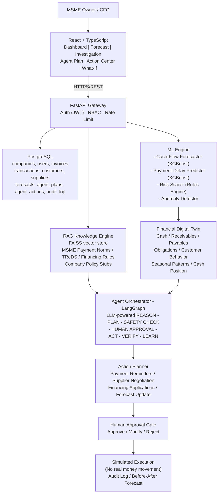
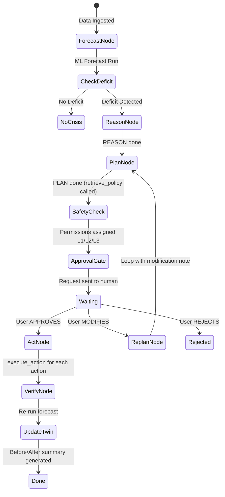

# CashFlow Guardian — Master Implementation Plan
**Autonomous Financial Early-Warning & Rescue Agent for MSMEs**
> *"Predict the cash crisis. Understand why. Plan the rescue. Act before it happens."*
> Track: FinTech → Agentic Finance

---

## 1. Problem Summary

MSMEs don't fail because they are unprofitable — they fail because they **run out of usable cash at the wrong time**. A timing mismatch between receivables and obligations creates a cash crisis that traditional dashboards only *report* after the fact.

**CashFlow Guardian** moves from Financial *Monitoring* → Financial *Prevention*:

| Traditional Tools | CashFlow Guardian |
|---|---|
| "Your balance is low." | "You will face a ₹1.4L deficit in 17 days." |
| Shows what happened | Predicts what WILL happen |
| User figures out solution | AI reasons, plans, and acts |
| Reactive | Proactive & Agentic |

**Core Innovation:** Financial Digital Twin + Predictive ML + Agentic AI (Reason → Plan → Act → Verify) + RAG + Human-in-the-Loop

---

## 2. System Architecture



### Division of Responsibility (strictly enforced)
| Layer | Responsibility |
|---|---|
| **ML** | Forecasting, payment-delay probabilities, risk scores, anomaly detection |
| **LLM** | Reasoning, explanation, plan generation, natural-language Q&A |
| **Rules Engine** | Safety constraints, permission levels, approval thresholds |
| **RAG** | Policy/guideline retrieval only — no calculations |

---

## 3. Complete Folder Structure

```
d:\Hackathon\
├── backend/
│   ├── main.py                         # FastAPI app entry point
│   ├── requirements.txt
│   ├── .env                            # LLM_API_KEY, DB_URL, JWT_SECRET
│   └── app/
│       ├── core/
│       │   ├── config.py               # Settings via pydantic-settings
│       │   ├── auth.py                 # JWT create/verify helpers
│       │   ├── permissions.py          # RBAC dependency (Owner/Finance/Viewer)
│       │   └── database.py             # SQLAlchemy async engine + session
│       ├── models/                     # SQLAlchemy ORM models
│       │   ├── company.py
│       │   ├── user.py
│       │   ├── financial.py            # customers, suppliers, invoices, payables, transactions, recurring_obligations
│       │   └── agent.py                # forecasts, risk_events, agent_plans, agent_actions, audit_log
│       ├── schemas/                    # Pydantic request/response schemas
│       │   ├── auth.py
│       │   ├── financial.py
│       │   └── agent.py
│       ├── routers/
│       │   ├── auth.py                 # POST /auth/register, /auth/login, /auth/refresh
│       │   ├── companies.py            # POST /companies, GET /companies/{id}/snapshot
│       │   ├── data.py                 # POST /companies/{id}/data/upload (CSV ingestion)
│       │   ├── forecast.py             # POST/GET /companies/{id}/forecast
│       │   ├── risk.py                 # GET /forecasts/{id}/risk
│       │   ├── agent.py                # POST /forecasts/{id}/plan, /plans/{id}/approve|reject|modify
│       │   ├── actions.py              # POST /actions/{id}/approve|execute, GET /companies/{id}/actions
│       │   ├── simulator.py            # POST /companies/{id}/simulate (what-if)
│       │   ├── ask.py                  # POST /companies/{id}/ask (RAG Q&A)
│       │   └── audit.py                # GET /companies/{id}/audit-log
│       ├── ml/
│       │   ├── forecast.py             # XGBoost + simulation cash-flow forecast
│       │   ├── payment_delay.py        # Payment delay predictor (per customer/invoice)
│       │   ├── risk.py                 # Rule-weighted risk scorer (0-100) + root causes
│       │   └── anomaly.py              # Simple anomaly detection on transactions
│       ├── agent/
│       │   ├── orchestrator.py         # LangGraph state machine (full workflow)
│       │   ├── tools.py                # Tool definitions (get_snapshot, run_forecast, etc.)
│       │   ├── prompts.py              # All LLM system/user prompts (REASON, PLAN, DRAFT, VERIFY)
│       │   └── rules_engine.py         # Permission level assignment (L1/L2/L3) + safety checks
│       └── rag/
│           ├── ingest.py               # Document chunking + FAISS index build
│           └── retrieve.py             # retrieve_policy() tool implementation
│
├── frontend/
│   ├── package.json
│   ├── tsconfig.json
│   ├── vite.config.ts
│   └── src/
│       ├── App.tsx                     # Router + auth guard
│       ├── main.tsx
│       ├── index.css                   # Design system tokens
│       ├── api/
│       │   └── client.ts               # Axios instance + all typed endpoint calls
│       ├── types/
│       │   └── index.ts                # Shared TypeScript interfaces
│       ├── store/
│       │   └── useAppStore.ts          # Zustand global state
│       ├── components/
│       │   ├── CashChart.tsx           # Recharts AreaChart (expected/best/worst bands)
│       │   ├── RiskBadge.tsx           # Color-coded risk score badge
│       │   ├── PlanOptionCard.tsx      # Option A/B/C/D display card
│       │   ├── ApprovalModal.tsx       # Approve/Modify/Reject modal
│       │   ├── AlertBanner.tsx         # Crisis alert with "Investigate" CTA
│       │   ├── AskGuardian.tsx         # Free-text Q&A box (calls /ask endpoint)
│       │   └── PermissionGate.tsx      # RBAC-aware wrapper component
│       └── pages/
│           ├── Login.tsx               # Auth page
│           ├── Dashboard.tsx           # Screen 1: Executive Dashboard
│           ├── Forecast.tsx            # Screen 2: Cash Flow Forecast chart
│           ├── Investigation.tsx       # Screen 3: AI Investigation + Ask Guardian
│           ├── AgentPlan.tsx           # Screen 4: Agent Plan (options + approve)
│           ├── ActionCenter.tsx        # Screen 5: Action status + audit trail
│           └── WhatIf.tsx              # Screen 6: What-if Simulator
│
├── data/
│   └── synthetic/
│       ├── generate_dataset.py         # Full synthetic MSME dataset generator
│       ├── seed_crisis.py              # Deterministic crisis scenario (ABC Precision)
│       ├── customers.csv
│       ├── suppliers.csv
│       ├── transactions.csv
│       ├── invoices.csv
│       ├── payables.csv
│       ├── loans.csv
│       └── expenses.csv
│
└── docs/
    └── policies/                       # RAG source documents (15-25 markdown files)
        ├── msme_payment_norms.md
        ├── treds_eligibility.md
        ├── invoice_financing_criteria.md
        ├── safety_reserve_policy.md
        ├── supplier_negotiation_policy.md
        ├── approval_threshold_policy.md
        └── ... (10+ more)
```

---

## 4. Database Schema (PostgreSQL)

### Core Entities

```sql
CREATE TABLE companies (
    company_id      UUID PRIMARY KEY DEFAULT gen_random_uuid(),
    name            TEXT NOT NULL,
    industry        TEXT,
    registration_no TEXT,
    safety_reserve  NUMERIC(14,2) DEFAULT 0,
    created_at      TIMESTAMPTZ DEFAULT now()
);

CREATE TABLE users (
    user_id       UUID PRIMARY KEY DEFAULT gen_random_uuid(),
    company_id    UUID REFERENCES companies(company_id),
    name          TEXT NOT NULL,
    email         TEXT UNIQUE NOT NULL,
    password_hash TEXT NOT NULL,
    role          TEXT CHECK (role IN ('owner','finance_manager','viewer')) DEFAULT 'viewer',
    created_at    TIMESTAMPTZ DEFAULT now()
);
```

### Financial Data

```sql
CREATE TABLE customers (
    customer_id       UUID PRIMARY KEY DEFAULT gen_random_uuid(),
    company_id        UUID REFERENCES companies(company_id),
    name              TEXT NOT NULL,
    avg_delay_days    NUMERIC(5,2) DEFAULT 0,
    reliability_score NUMERIC(5,2) DEFAULT 100
);

CREATE TABLE suppliers (
    supplier_id   UUID PRIMARY KEY DEFAULT gen_random_uuid(),
    company_id    UUID REFERENCES companies(company_id),
    name          TEXT NOT NULL,
    negotiability TEXT CHECK (negotiability IN ('high','medium','low')) DEFAULT 'medium',
    penalty_rate  NUMERIC(5,2) DEFAULT 0
);

CREATE TABLE invoices (
    invoice_id          UUID PRIMARY KEY DEFAULT gen_random_uuid(),
    company_id          UUID REFERENCES companies(company_id),
    customer_id         UUID REFERENCES customers(customer_id),
    amount              NUMERIC(14,2) NOT NULL,
    issue_date          DATE NOT NULL,
    due_date            DATE NOT NULL,
    status              TEXT CHECK (status IN ('open','paid','overdue','financed')) DEFAULT 'open',
    predicted_pay_date  DATE,
    predicted_pay_prob  NUMERIC(5,2)
);

CREATE TABLE payables (
    payable_id  UUID PRIMARY KEY DEFAULT gen_random_uuid(),
    company_id  UUID REFERENCES companies(company_id),
    supplier_id UUID REFERENCES suppliers(supplier_id),
    amount      NUMERIC(14,2) NOT NULL,
    due_date    DATE NOT NULL,
    status      TEXT CHECK (status IN ('open','paid','delayed')) DEFAULT 'open',
    priority    TEXT CHECK (priority IN ('critical','normal','flexible')) DEFAULT 'normal'
);

CREATE TABLE recurring_obligations (
    obligation_id    UUID PRIMARY KEY DEFAULT gen_random_uuid(),
    company_id       UUID REFERENCES companies(company_id),
    type             TEXT CHECK (type IN ('payroll','rent','emi','tax','subscription','utility')),
    amount           NUMERIC(14,2) NOT NULL,
    due_day_of_month INT,
    frequency        TEXT CHECK (frequency IN ('monthly','quarterly','annual')) DEFAULT 'monthly'
);

CREATE TABLE transactions (
    txn_id        UUID PRIMARY KEY DEFAULT gen_random_uuid(),
    company_id    UUID REFERENCES companies(company_id),
    txn_date      DATE NOT NULL,
    amount        NUMERIC(14,2) NOT NULL,
    category      TEXT,
    counterparty  TEXT,
    balance_after NUMERIC(14,2)
);
```

### AI / Agent Layer

```sql
CREATE TABLE forecasts (
    forecast_id      UUID PRIMARY KEY DEFAULT gen_random_uuid(),
    company_id       UUID REFERENCES companies(company_id),
    generated_at     TIMESTAMPTZ DEFAULT now(),
    horizon_days     INT DEFAULT 30,
    daily_projection JSONB,
    deficit_day      INT,
    deficit_amount   NUMERIC(14,2),
    risk_score       NUMERIC(5,2)
);

CREATE TABLE risk_events (
    event_id      UUID PRIMARY KEY DEFAULT gen_random_uuid(),
    forecast_id   UUID REFERENCES forecasts(forecast_id),
    cause_type    TEXT,
    reference_id  UUID,
    impact_amount NUMERIC(14,2),
    severity      TEXT CHECK (severity IN ('high','medium','low'))
);

CREATE TABLE agent_plans (
    plan_id            UUID PRIMARY KEY DEFAULT gen_random_uuid(),
    forecast_id        UUID REFERENCES forecasts(forecast_id),
    company_id         UUID REFERENCES companies(company_id),
    reasoning_text     TEXT,
    options            JSONB,
    recommended_option TEXT,
    status             TEXT CHECK (status IN ('proposed','approved','rejected','modified')) DEFAULT 'proposed',
    created_at         TIMESTAMPTZ DEFAULT now()
);

CREATE TABLE agent_actions (
    action_id        UUID PRIMARY KEY DEFAULT gen_random_uuid(),
    plan_id          UUID REFERENCES agent_plans(plan_id),
    action_type      TEXT,
    target_ref_id    UUID,
    permission_level TEXT CHECK (permission_level IN ('L1_auto','L2_approval','L3_strict')),
    status           TEXT CHECK (status IN ('pending_approval','approved','executed','rejected')) DEFAULT 'pending_approval',
    payload          JSONB,
    executed_at      TIMESTAMPTZ,
    approved_by      UUID REFERENCES users(user_id)
);

CREATE TABLE audit_log (
    log_id     UUID PRIMARY KEY DEFAULT gen_random_uuid(),
    company_id UUID REFERENCES companies(company_id),
    actor      TEXT,
    action     TEXT,
    details    JSONB,
    created_at TIMESTAMPTZ DEFAULT now()
);
```

---

## 5. ML Models — Detailed Design

### Model 1: Payment-Delay Predictor
**Goal:** Predict expected payment delay (days) per open invoice

**Features:**
- Customer `avg_delay_days`, `std_delay_days` (historical)
- Invoice amount (binned), invoice age in days, is_overdue flag
- Customer profile type (reliable / moderate / chronic_late)
- Day-of-week / month seasonality features
- Customer concentration risk

**Approach:** XGBoost Regressor
**Output:** `predicted_delay_days` → `predicted_pay_date = due_date + delay`

---

### Model 2: Payment Probability Classifier
**Goal:** Probability that an invoice is paid by a specific target date

**Features:** Same as above + `(target_date - today)` as time window
**Approach:** XGBoost Classifier → probability 0–1
**Output:** `predicted_pay_prob` stored on the invoices table

---

### Model 3: Cash-Flow Forecaster (30-Day Horizon)
**Goal:** Project daily cash balance as 3 bands (expected / best / worst)

**Approach:** Deterministic simulation + Monte Carlo (200 samples):

```
daily_cash[0] = current_bank_balance

for day in range(1, 31):
    inflows = sum(
        invoice.amount * predicted_pay_prob
        for open invoices where predicted_pay_date == today + day
    )
    outflows = (
        payables due on this day
        + recurring obligations due on this day
    )
    daily_cash[day] = daily_cash[day-1] + inflows - outflows

# P10 = worst, P50 = expected, P90 = best
```

**Output shape (stored in forecasts.daily_projection):**
```json
[
  {"day": 0,  "expected": 620000, "best": 620000, "worst": 620000},
  {"day": 5,  "expected": 410000, "best": 480000, "worst": 350000},
  {"day": 17, "expected": -140000, "best": 60000, "worst": -420000},
  {"day": 30, "expected": 80000,  "best": 300000, "worst": -150000}
]
```

---

### Model 4: Risk Scorer (Rules Engine — Explainable)
**Goal:** Compute Cash Flow Risk Score (0–100) with ranked root causes

**Formula:**
```python
deficit_severity  = abs(deficit_amount) / safety_reserve     # weight 40%
time_pressure     = max(0, 1 - deficit_day / 30)             # weight 35%
cause_confidence  = avg_confidence_of_top3_risk_events       # weight 25%

risk_score = min(100, 100 * (
    0.40 * deficit_severity +
    0.35 * time_pressure +
    0.25 * cause_confidence
))
```

**Root Cause Ranking:** Sort `risk_events` by `impact_amount DESC`.
Assign severity HIGH / MEDIUM / LOW relative to `safety_reserve` thresholds.

---

## 6. RAG Knowledge Base

### Documents to Create (`docs/policies/`)

| File | Content |
|---|---|
| `msme_payment_norms.md` | MSMED Act 45-day payment rule summary |
| `treds_eligibility.md` | TReDS platform eligibility criteria |
| `invoice_financing_criteria.md` | Invoice financing eligibility (amount, age, rating) |
| `early_payment_request_policy.md` | When and how to request early customer payment |
| `supplier_negotiation_policy.md` | Delay ranges, penalty awareness, negotiation tactics |
| `safety_reserve_policy.md` | Minimum cash buffer recommendations by MSME size |
| `approval_threshold_policy.md` | Which actions require which approval level |
| `working_capital_management.md` | General MSME working capital best practices |
| `cash_flow_seasonality_guide.md` | Handling seasonal patterns |
| `receivables_collection_guide.md` | Escalation timelines for overdue invoices |
| `loan_vs_financing_comparison.md` | Invoice financing vs. short-term loans |
| `risk_mitigation_strategies.md` | Diversification, concentration risk, customer vetting |
| `government_schemes_msme.md` | CGTMSE, Mudra, other government schemes |
| `guardian_permission_levels.md` | L1/L2/L3 action permission definitions |
| `crisis_prevention_playbook.md` | Step-by-step guide for different crisis types |

**RAG Stack:** LangChain + FAISS (offline-capable, no external service)
- Chunk size: ~350 tokens, 50-token overlap
- Top-k retrieval: 3 chunks per query
- Embedding: `text-embedding-3-small` (OpenAI) or `all-MiniLM-L6-v2` (free, offline)

---

## 7. Agent Orchestrator — LangGraph Workflow



### Agent Tools

| Tool | Description | Level |
|---|---|---|
| `get_financial_snapshot` | Fetch current cash, receivables, payables, obligations | L1 |
| `run_cash_forecast` | Run ML forecast engine | L1 |
| `get_risk_breakdown` | Get ranked root causes | L1 |
| `retrieve_policy` | RAG lookup over policy corpus | L1 |
| `simulate_scenario` | What-if: re-run forecast with hypothetical change | L1 |
| `draft_action` | Generate LLM content for proposed action (no execution) | L2 |
| `request_approval` | Submit plan for human approval (blocks workflow) | L2 |
| `execute_action` | Simulated execution — **code-gated on status='approved'** | L2 |

> [!IMPORTANT]
> `execute_action` must be **code-gated** on `agent_actions.status == 'approved'` in Python — not just in the LLM prompt. Judges will test this boundary deliberately.

---

## 8. LLM Prompts (4 Stages)

### REASON Stage
```
SYSTEM: You are Guardian, a financial reasoning assistant for an MSME owner.
You are given a cash-flow forecast and a ranked list of risk events.
Explain in plain language WHY a cash deficit is projected. Be specific about
which receivables/payables/obligations are driving it and by how much.
Do not recommend actions yet. Do not use unexplained jargon. Max 120 words.

USER: Forecast: {forecast_json}
Risk events: {risk_events_json}
```

### PLAN Stage
```
SYSTEM: You are Guardian's planning module. Propose 3-4 distinct options to
close the projected deficit. For each option provide: description, expected
cash impact (INR), cost_level (low/medium/high), risk_level, confidence (0-1).
If financing eligibility is relevant, call retrieve_policy first.
Then recommend ONE option and justify in 2-3 sentences.
Output strict JSON: {"options": [...], "recommended": "A|B|C|D", "justification": "..."}

USER: Reasoning: {reasoning_text}
Available levers: {levers_json}
Safety reserve: {safety_reserve}
```

### ACTION DRAFT Stage
```
SYSTEM: Draft the content for the following approved action. Keep it
professional, factual, and non-threatening. This is a DRAFT for human
review — do not claim it has been sent. Do not invent financial figures
not in the context.

USER: Action type: {action_type}
Context: {target_details_json}
```

### VERIFY Stage
```
SYSTEM: Compare the forecast before and after the executed actions.
State the change in deficit/surplus clearly in one short paragraph
suitable for a dashboard notification.

USER: Before: {before_forecast}
After: {after_forecast}
```

---

## 9. Action Permission System

| Level | Name | What AI Can Do |
|---|---|---|
| L1 — Green | Automatic | Analyze, forecast, alert, generate reports |
| L2 — Yellow | Approval Required | Payment reminders, supplier negotiation drafts, financing applications |
| L3 — Red | Strict / Blocked | Money transfer, borrowing, bank changes — **never implemented** |

---

## 10. API Endpoints (FastAPI)

### Auth
```
POST /auth/register
POST /auth/login
POST /auth/refresh
```

### Company & Data
```
POST  /companies
GET   /companies/{id}/snapshot
POST  /companies/{id}/data/upload
```

### Forecasting
```
POST  /companies/{id}/forecast
GET   /companies/{id}/forecast/latest
GET   /forecasts/{id}/risk
```

### Agent
```
POST  /forecasts/{id}/plan
POST  /plans/{id}/approve
POST  /plans/{id}/reject
POST  /plans/{id}/modify
```

### Actions
```
POST  /actions/{id}/approve
POST  /actions/{id}/execute
GET   /companies/{id}/actions
```

### Simulator & Q&A
```
POST  /companies/{id}/simulate
POST  /companies/{id}/ask
GET   /companies/{id}/audit-log
```

**All routes:** JWT bearer required. Viewer role is read-only across all POST routes.

---

## 11. Frontend — 6 Screens

### Screen 1 — Executive Dashboard
- KPI cards: Cash Available, Projected Cash, Risk Score badge, Next Crisis countdown
- Receivables vs Payables summary cards
- Alert Banner: "₹1.4L deficit predicted in 17 days" → [Investigate] CTA
- Mini sparkline cash timeline

### Screen 2 — Cash Flow Forecast
- Recharts `AreaChart` with 3 bands: Expected (solid line), Best (green fill), Worst (red fill)
- Horizon toggle: 7 / 30 / 60 days
- Deficit day marker (vertical dashed red line with label)
- Before/After overlay visible after plan execution

### Screen 3 — AI Investigation
- Risk score ring gauge (large number, color-coded)
- Root cause list: icon, name, impact amount, severity badge per item
- "Ask Guardian" free-text box → streaming LLM answer panel
- "Generate Rescue Plan" primary button

### Screen 4 — Agent Plan
- 3–4 `PlanOptionCard` (A/B/C/D) with: description, impact badge, cost/risk level indicators, confidence bar
- Recommended option highlighted with glow/accent border
- LLM reasoning text (collapsible)
- [Approve Plan] [Modify] [Reject] buttons + `ApprovalModal`

### Screen 5 — Action Center
- Status list per action: icon, type, target entity, status badge (Pending/Sent/Executed/Rejected)
- Expanding row showing LLM-drafted content
- Audit trail timeline at bottom

### Screen 6 — What-If Simulator
- Variable selector: Customer delay / Supplier delay / New one-time expense
- Slider or numeric input for magnitude
- Side-by-side before/after `AreaChart`
- Auto Guardian recommendation for the new scenario

---

## 12. Synthetic Dataset Generator

### Scale
| Entity | Count | Note |
|---|---|---|
| Companies | 15–20 | Demo on "ABC Precision Components" |
| Customers per company | 40–60 | 50% reliable, 35% moderate, 15% chronic_late |
| Suppliers per company | 20–30 | Varying negotiability & penalty_rate |
| Transactions | 500–1000 | 6–12 months history |
| Invoices | 80–150 | Mix of paid, open, overdue |

### Customer Profiles (Python)
```python
PROFILES = {
    "reliable":     {"mean_delay": 1,  "std": 1},
    "moderate":     {"mean_delay": 5,  "std": 2},
    "chronic_late": {"mean_delay": 12, "std": 4},
}
```

### Scripted Crisis Scenario (ABC Precision Components)
```
Current cash:       ₹6.2L
Customer A (chronic_late): ₹3.0L invoice, due Day 5, expected Day 16
Supplier B payment: ₹2.5L due Day 8 (flexible)
Payroll:            ₹1.8L due Day 10
EMI:                ₹0.8L due Day 12
Tax obligation:     ₹1.2L due Day 15

Projected result:   ₹1.4L deficit on Day 17 → Risk Score: 82/100
```

- `generate_dataset.py` — randomized, for judge testing
- `seed_crisis.py` — deterministic, always reproduces the exact ABC Precision scenario

---

## 13. Security Architecture

| Area | Implementation |
|---|---|
| Authentication | JWT access tokens (15 min) + refresh tokens (7 days) |
| Password hashing | bcrypt via passlib |
| Authorization | RBAC FastAPI dependency: Owner / Finance Manager / Viewer |
| Transport | HTTPS (nginx termination in deployment) |
| Secrets | python-dotenv / `.env` — no credentials in source code |
| AI security | `execute_action` code-gated on DB approval status (not just prompt) |
| Prompt injection | RAG/user content clearly delimited — never treated as agent instructions |
| Audit trail | Every recommendation, approval, and execution logged to `audit_log` |
| L3 actions | Blocked in code — UI shows "not available in prototype" |
| Data | Synthetic only — no real banking credentials anywhere |

---

## 14. 48-Hour Development Timeline

### Hour 0–4 — Setup & Data
- [ ] Git repo init + monorepo scaffolding (frontend/ + backend/)
- [ ] Install all dependencies (`requirements.txt` + `package.json`)
- [ ] PostgreSQL + Alembic migrations applied
- [ ] `seed_crisis.py` runs; crisis data verified in DB

### Hour 4–12 — Core Backend
- [ ] SQLAlchemy ORM models matching full schema
- [ ] CSV ingestion endpoint handles all 6 file types
- [ ] Financial snapshot endpoint (`/snapshot`)
- [ ] Payment-delay ML model trained + `/predict-delay` endpoint
- [ ] Cash-flow forecaster + `/forecast` endpoint (30-day JSONB output)
- [ ] Risk scorer rules engine + `/risk` endpoint with root-cause list

### Hour 12–20 — Agent Layer
- [ ] LangGraph orchestrator: REASON → PLAN nodes wired
- [ ] All 4 LLM prompts implemented and tested on crisis data
- [ ] 15 RAG policy documents written → FAISS index built
- [ ] `retrieve_policy()` tool integrated into PLAN node
- [ ] `/investigate` and `/rescue-plan` endpoints end-to-end

### Hour 20–28 — Approval & Action Layer
- [ ] Plan approve/reject/modify endpoints
- [ ] `draft_action()` — LLM generates email/negotiation draft
- [ ] L1/L2/L3 permission gating enforced in Python
- [ ] `execute_action()` — writes to DB, updates status, re-runs forecast
- [ ] Audit log wired to all state changes
- [ ] VERIFY node: before/after comparison + LLM summary

### Hour 28–36 — Frontend Core
- [ ] Vite + React + TS + Tailwind project set up
- [ ] Axios client + all typed API calls in `client.ts`
- [ ] Login page + JWT auth guard in `App.tsx`
- [ ] Dashboard (KPI cards + alert banner)
- [ ] Forecast page (Recharts 3-band AreaChart)
- [ ] Investigation page (risk list + Ask Guardian)
- [ ] Agent Plan page (PlanOptionCards + Approve/Modify/Reject)

### Hour 36–42 — Frontend Polish + What-If
- [ ] Action Center page
- [ ] What-If Simulator page
- [ ] Before/After forecast overlay (key demo moment)
- [ ] **Full end-to-end walkthrough on seeded crisis data — MUST WORK FLAWLESSLY**

### Hour 42–46 — Demo Prep
- [ ] Script and rehearse the 2-minute demo
- [ ] Fix rough edges in the exact demo path only
- [ ] Prepare backup screenshots/video for live demo failure

### Hour 46–48 — Buffer
- [ ] Handle anything overrunning
- [ ] Final README with how-to-run instructions

---

## 15. Final Demo Script (2 Minutes)

| Time | Action | Narration |
|---|---|---|
| 0:00 | Dashboard | *"This company has ₹6.2 lakh cash — looks completely healthy."* |
| 0:20 | Click Forecast | *"Our AI predicts a ₹1.4 lakh cash deficit in exactly 17 days."* |
| 0:40 | Click Investigate | AI shows: Customer A (₹3L delayed) + Supplier B (₹2.5L) + Payroll (₹1.8L) |
| 0:55 | Ask Guardian | *"Why will I run out of cash?"* → AI explains timing mismatch |
| 1:05 | Generate Rescue Plan | Agent produces Options A/B/C/D with impact/cost/risk + cites TReDS policy for C |
| 1:20 | Select Plan D | Show reasoning + ₹5.5L combined impact |
| 1:30 | Click Approve | ApprovalModal → Confirm |
| 1:40 | Actions execute | Action Center: Reminder sent, Negotiation drafted, Forecast updated |
| 2:00 | Return to Forecast | BEFORE Day 17 = -₹1.4L → AFTER Day 17 = +₹3.1L |
| 2:05 | Close | *"We didn't build an AI that tells an entrepreneur they're in trouble. We built an AI agent that sees it coming — and helps prevent it."* |

---

## 16. MVP Checklist (7 Non-Negotiable Items)

- [ ] CSV data ingestion (all 6 entity types)
- [ ] Cash-flow forecasting — ML, 30-day horizon, 3 bands
- [ ] Payment-delay prediction — per customer/invoice, ML
- [ ] Risk detection — rules + ML, 0–100 score + root causes
- [ ] AI investigation — LLM explanation grounded in real computed data
- [ ] Agentic rescue plan — REASON → PLAN with RAG policy retrieval, 3–4 ranked options
- [ ] Action + human approval + simulated execution + before/after forecast recalculation

> [!IMPORTANT]
> Build these 7 in sequence. Do NOT add features beyond this list until all 7 work end-to-end on the seeded crisis scenario.

> [!WARNING]
> Never claim real bank access, guaranteed outcomes, or autonomous money movement. Always frame as: *"Prototype demonstrates autonomous financial workflows on synthetic data, designed for banking/accounting API integration."*

---

## 17. Technology Stack

| Layer | Technology | Rationale |
|---|---|---|
| Frontend | React 18 + TypeScript + Vite | Type safety, fast HMR |
| Styling | Tailwind CSS | Rapid design-system-aligned UI |
| Charts | Recharts AreaChart | Best 3-band time-series visualization |
| HTTP | Axios + React Query | Typed calls + caching |
| State | Zustand | Lightweight, no boilerplate |
| Backend | Python + FastAPI | Async, auto-docs, ML ecosystem native |
| ORM | SQLAlchemy 2.0 + Alembic | Async queries + schema migrations |
| Database | PostgreSQL (SQLite for hackathon speed) | UUID keys, JSONB for projections |
| ML | XGBoost + scikit-learn + pandas + numpy | Fast, explainable, no GPU needed |
| Agent | LangGraph | Stateful REASON→PLAN→ACT graph |
| LLM | GPT-4o / Claude 3.5 Sonnet / Gemini 1.5 Pro | Choose based on available API keys |
| RAG | LangChain + FAISS + sentence-transformers | Offline-capable, no external service |
| Auth | python-jose (JWT) + passlib (bcrypt) | Standard FinTech security pattern |

---

## 18. What to Claim vs. Not Claim

| CLAIM | DO NOT CLAIM |
|---|---|
| "Prototype demonstrates autonomous financial decision workflows on synthetic data" | "We can access everyone's bank account" |
| "Designed for integration with banking/accounting APIs" | "Our AI guarantees businesses won't fail" |
| "Financial Digital Twin models real MSME cash dynamics" | "AI can autonomously transfer money" |
| "Agentic Reason→Plan→Act→Verify loop with human oversight" | "This is production-ready today" |
